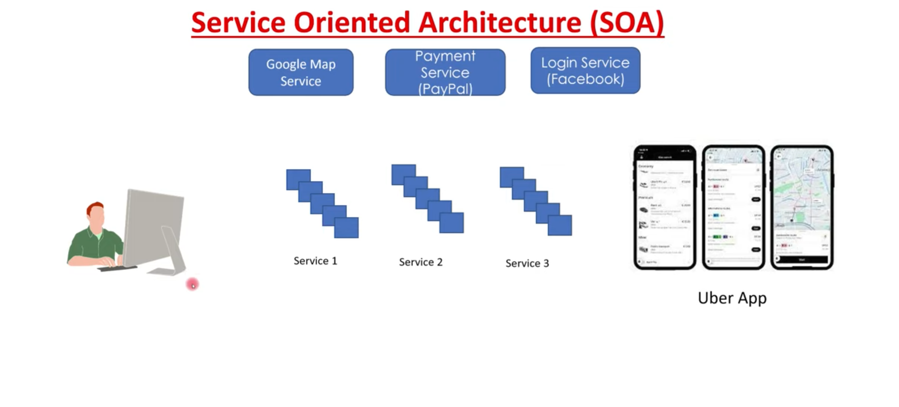

# What is SOA?

Service-oriented architecture(SOA) is a method of software development that uses software components called services to create our business applications.

For example, for creating an application like Uber on our own we have to create user interfaces and logic to authenticate a user and map for directions and payment which will take a lot of time to develop the application. Some of the functionality cannot be done without using some third-party services. With the help of SOA, we can create our applications faster by using services built for specific uses like Google Maps service which we can integrate into our application.

## Benefits of service-oriented architecture

 - **Faster time to market** 
    We can create our application and release it into the market faster by using the services.

 - **Efficient maintenance**
    We should maintain our code and not worry about the functionality of services because service providers are responsible for the maintenance of the services they are providing.
  
 - **Greater adaptability**
    We can adapt to newer services easily and cost-effectively.

 - **Service reusability**
  In SOA, applications are made from existing services. Thus, services can be reused to make many applications.
 - **Scalability**
   Services can run on different servers within an environment, this increases scalability

## Basic principles of service-oriented architecture

- **Interoperability** 

    Each service in SOA includes description documents that specify the functionality of the service and the related terms and conditions. Any client system can run a service, regardless of the underlying platform or programming language. For instance, business processes can use services written in both C# and Python. Since there are no direct interactions, changes in one service do not affect other components using the service.

- **Loose coupling**

   Services in SOA should be loosely coupled, having as little dependency as possible on external resources such as data models or information systems. They should also be stateless without retaining any information from past sessions or transactions. This way, if you modify a service, it won’t significantly impact the client applications and other services using the service.

 - **Abstraction**
  
   Clients or service users in SOA need not know the service's code logic or implementation details. To them, services should appear like a black box. Clients get the required information about what the service does and how to use it through service contracts and other service description documents.

 - **Granularity**
  
    Services in SOA should have an appropriate size and scope, ideally packing one discrete
    business function per service. Developers can then use multiple services to create a composite service for performing complex operations.

## Four main components of service-oriented architecture

 - **Service**
    - Services are the basic building blocks of SOA. 
    - Service can be private, or public.
    - **Service contract** :
     It defines associated terms and conditions like prerequisites for using the service, service cost, and quality of service provided.
    - **Service interface** :
    Services provide an interface on how to communicate with a service through its service interface. It reduces dependencies between services and the service requester. 

    - **Service implementation**:
    Service providers are responsible for the implementation.

  - **Service provider**
    - The service provider creates, maintains, and provides one or more services that others can use.

  - **Service consumer**
    - Service consumers can easily discover the services they need by using the service registry. The service consumer requests the service provider to run a specific service. The service contract specifies the rules that the service provider and consumer must follow when interacting with each other.
  
  - **Service registry**
    - A service registry/broker/repository stores service description documents from service providers. The description documents contain information about the service and how to communicate with it. Service consumers can easily discover the services they need by using the service registry.

 ## How does service-oriented architecture work?

  1. Service providers will publish services into the service registry.
  2. Service consumers/requesters/users can find the services in the service registry.
  3. Based on the need service user can get the link of the service to integrate into the application from the service registry.
  4. Now the service user can communicate with the service provider or request to get the information by providing essential data to the service provider.
  5. Service provider will process the request and provide the service accordingly.

## Communication protocols

Services communicate using established rules that determine data transmission over a network. These rules are called communication protocols. Some standard protocols to implement SOA include the following:

- Simple Object Access Protocol (SOAP)
- RESTful HTTP
- Apache Thrift
- Apache ActiveMQ
- Java Message Service (JMS)
   
## Conclusion

Service-Oriented Architecture (SOA) is an architectural style that organizes software applications as a collection of loosely coupled services. These services are well-defined, self-contained, and communicate with each other over a network, typically using standardized protocols such as HTTP or SOAP. SOA aims to promote reusability, flexibility, and interoperability by breaking down complex applications into smaller, modular services that can be independently developed, deployed, and scaled. 

## Reference links
 - [Overview on SOA](https://www.youtube.com/watch?v=PA9RjHI463g)
 - [What is SOA by AWS](https://aws.amazon.com/what-is/service-oriented-architecture/)
 - [SOA - geekforgeeks](https://www.geeksforgeeks.org/service-oriented-architecture/)